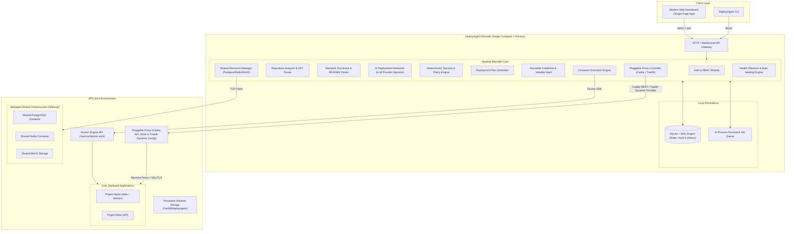

# DeployAgent: AI-First Autonomous Deployment Platform
## System Architecture, Competitor R&D, High-Level Design (HLD), and Low-Level Design (LLD)

**Document Version:** 1.0.0  
**Target Architecture:** Modular Monolith (Open-Source Self-Hosted)  
**Execution Environment:** Single VPS / Linux Host with Docker Engine & Caddy  

---

## 1. Executive Summary & Vision

DeployAgent is an open-source, AI-first autonomous deployment platform designed for self-hosting on a single virtual private server (VPS).

Traditional self-hosted Platform-as-a-Service (PaaS) tools require engineers to manually specify build parameters, manage port forwarding, wire up backing databases, construct reverse proxy rules, and decipher `.env.example` templates. DeployAgent removes this configuration burden by accepting a single input—a Git repository URL—and autonomously executing the entire deployment lifecycle:

1. **Repository Analysis:** Inspects repository files, manifests, frameworks, and architecture.
2. **README & Documentation Understanding:** Semantically extracts runtime dependencies, configuration parameters, and environmental prerequisites.
3. **Resource Matching & Shared Infrastructure:** Dynamically detects whether backing services (e.g., PostgreSQL, Redis) can be shared or must be provisioned independently.
4. **Environment Variable Synthesis:** Auto-generates cryptographic secrets, computes database connection URIs, reuses existing credentials where applicable, and queries the user only for strictly necessary external API credentials.
5. **Deterministic Plan Generation & Guardrails:** Produces an auditable, versioned deployment plan validated by deterministic security policies before containerization.
6. **Execution & Ingress Orchestration:** Builds container images, configures persistent volumes, connects software-defined networks, and programs Caddy reverse proxy with automatic SSL/TLS.
7. **Verification & Self-Healing:** Monitors application health, inspects runtime logs, detects startup anomalies (e.g., missing database migrations or misconfigured ports), and applies remediation automatically.

To ensure minimal resource consumption and frictionless self-hosting, DeployAgent is designed strictly as a **Modular Monolith** distributed as a single container image.

---

## 2. Competitor R&D & Strategic Differentiation

### 2.1 The Competitive Landscape

| Platform | License / Type | Architecture | Setup Model | AI Capability | Shared Infra Reuse |
| :--- | :--- | :--- | :--- | :--- | :--- |
| **Coolify** | Open-Source / Self-Hosted | Monolith + Workers (Laravel/PHP + Docker/Traefik) | Template-driven or manual Dockerfile/Compose | None (strictly manual configuration) | Manual linking |
| **Dokploy** | Open-Source / Self-Hosted | Monolith (Node.js/Next.js + Docker/Traefik) | Template-driven / Nixpacks | None | Manual linking |
| **CapRover** | Open-Source / Self-Hosted | Monolith (Node.js + Docker Swarm + Nginx) | App store / Captain-definition files | None | Manual linking |
| **Railway** | Proprietary SaaS | Distributed Microservices | Buildpack/Nixpacks + Canvas | Minimal (CLI assistive chat only) | Manual canvas connections |
| **Kamal 2** | Open-Source CLI | Lightweight Ruby CLI + Docker | Manual `deploy.yml` configuration | None | Dedicated accessories only |
| **Zeabur** | Proprietary SaaS | Distributed Control Plane | Automatic framework detection | Basic chat assistant | Automated per project |
| **DeployAgent (Our Platform)** | **Open-Source (MIT/Apache 2.0)** | **Modular Monolith (Single Container)** | **Zero-Config (Git URL $\rightarrow$ Live Subdomain)** | **AI-First Autonomous Reasoning Engine** | **Automated Multi-Tenant Infrastructure Sharing** |

### 2.2 Critical Gaps in Existing Platforms

1. **The "Configuration Wall":** Current platforms such as Coolify and Dokploy maintain pre-built catalogs for popular open-source software (e.g., WordPress, Plausible, Ghost). However, when a developer provides an arbitrary GitHub repository, the platform halts and asks the user to populate environment variables, set build commands, define container ports, and configure database connections.
2. **The "Duplicate Infrastructure" Penalty:** Deploying three projects that each require PostgreSQL results in three separate PostgreSQL containers running on the host, consuming up to 1.5 GB of RAM in baseline idle overhead. Existing platforms lack an automated tenant manager that creates isolated databases and users inside an existing shared database cluster.
3. **Lack of Semantic Context:** No existing self-hosted PaaS parses project documentation (README, documentation directories, docker-compose comments). If an application requires a specific initialization command (`npm run db:migrate` or `python manage.py migrate`), current platforms fail silently or crash on first run.

### 2.3 The DeployAgent Value Proposition

- **Repository Ingestion:** Provide any GitHub repository URL (public or private via personal access token).
- **Zero-Friction Variable Resolution:** README instructions and `.env.example` templates are translated into categorized variables:
  - *Cryptographic Secrets:* Generated instantly using high-entropy random bytes (e.g., `APP_KEY`, `JWT_SECRET`, `SESSION_SECRET`).
  - *Internal Service URIs:* Computed automatically and injected based on provisioned or shared resources (e.g., `DATABASE_URL`, `REDIS_URL`).
  - *External Credentials:* Prompted via a pre-filled, context-aware user interface that explains why the key is needed directly from project documentation.
- **Unified Modular Monolith:** No distributed message brokers, multi-container control planes, or external microservices required to run the platform itself.

---

## 3. High-Level Design (HLD)

### 3.1 Architectural Philosophy: Why Modular Monolith?

Open-source self-hosters prioritize:
1. Low memory footprint ($\le 250\text{ MB}$ idle RAM for the control plane).
2. Trivial installation: `curl -fsSL https://get.deployagent.dev | sh` or a single `docker run` command.
3. Single persistent volume for all application state and configuration.
4. Simplified debugging: unified logging, in-memory event bus, and zero inter-service network partitioning issues.

DeployAgent organizes all capabilities into clear domain boundaries within a single process, utilizing internal dependency injection and domain event emitters.

### 3.2 High-Level System Architecture Diagram



### 3.3 End-to-End Autonomous Deployment Flow

```mermaid
sequenceDiagram
    autonumber
    actor User as User
    participant Web as Web Dashboard
    participant API as API Controller
    participant Analyzer as Repo & Doc Analyzer
    participant AI as AI Reasoner
    participant Policy as Policy Engine
    participant Vault as Credential Vault
    participant ResMgr as Shared Resource Manager
    participant Exec as Execution Engine
    participant Proxy as Proxy Controller (Caddy/Traefik)
    participant App as Target App Container

    User->>Web: Enter Git URL (e.g., https://github.com/org/repo)
    Web->>API: POST /api/deployments/analyze
    API->>Analyzer: Clone shallow snapshot & run static inspection
    Analyzer->>Analyzer: Detect files: Dockerfile, package.json, .env.example, README.md
    Analyzer->>AI: Provide normalized manifest + parsed doc sections
    AI->>AI: Synthesize runtime architecture, required ports, DB types, env vars
    AI-->>API: Draft Deployment Plan
    API->>Policy: Validate container privileges, port conflicts, host mounts
    Policy-->>API: Policy Passed / Review Required
    API->>ResMgr: Check existing shared resources (e.g., Postgres exists?)
    ResMgr-->>API: Postgres compatible; Redis compatible
    API->>Vault: Match detected variables against existing Vault credentials
    Vault-->>API: Match Found (e.g., OPENAI_API_KEY from Project Alpha) + New System Secrets
    API-->>Web: Present Interactive Plan with Reuse/New Choice & Descriptions
    User->>Web: Select "Use Existing" or "Provide New" (with description) & click "Deploy"
    Web->>API: POST /api/deployments/execute (Plan ID + Variable Decisions)
    API->>Vault: Bind or create credential with description & scope
    API->>ResMgr: Provision tenant DB (CREATE DATABASE app_db, USER app_user)
    API->>Exec: Build image (or run Compose / Nixpacks)
    Exec->>Exec: Start containers on isolated bridge network
    Exec->>Proxy: Register reverse proxy route (app.domain.com -> container:port)
    Exec->>Exec: Run database migrations if defined in plan
    Exec->>App: Perform TCP / HTTP health probes
    App-->>Exec: 200 OK Health Check Passed
    Exec-->>Web: Deployment Active (Live URL with SSL via Caddy/Traefik)
```

---

## 4. Low-Level Design (LLD)

### 4.1 Domain Module Breakdown

DeployAgent follows a strictly decoupled modular monolith architecture inside a single codebase.

```
deployagent/
├── src/
│   ├── modules/
│   │   ├── analyzer/         # Repository ingestion & static AST inspection
│   │   ├── doc-parser/       # README, docs, markdown extraction & semantic chunking
│   │   ├── ai-reasoner/      # LLM gateway (OpenAI, Anthropic, Gemini, Ollama)
│   │   ├── policy/           # Deterministic security rules & privilege bounds
│   │   ├── planner/          # Deployment plan generation & versioning
│   │   ├── secrets/          # AES-256-GCM encrypted vault & secret generator
│   │   ├── resources/        # Shared infrastructure providers (Postgres, Redis, MinIO)
│   │   ├── executor/         # Docker Engine API client & lifecycle supervisor
│   │   ├── ingress/          # Caddy Admin REST API controller
│   │   ├── observer/         # Health monitoring, log tailing & diagnostic auto-healer
│   │   └── api/              # Fastify HTTP & WebSocket routes
│   ├── common/
│   │   ├── db/               # SQLite + Drizzle ORM database access layer
│   │   ├── queue/            # SQLite-backed persistent FIFO job queue
│   │   └── event-bus/        # Typed in-process Node.js EventEmitter
│   ├── web/                  # Embedded React / Tailwind SPA dashboard
│   └── main.ts               # Application bootstrap
```

#### Module 1: Repository & Documentation Analyzer (`analyzer` & `doc-parser`)
- Performs shallow clones (`git clone --depth 1`) into a sandboxed temporary scratch directory.
- Extracts key manifest files without processing unnecessary vendor directories (`node_modules`, `.git`, `vendor`).
- Analyzers:
  - **Docker Analyzer:** Detects `Dockerfile`, `docker-compose.yml`, `compose.yaml`.
  - **Framework Analyzer:** Inspects `package.json`, `pyproject.toml`, `requirements.txt`, `go.mod`, `Cargo.toml`, `Gemfile`, `pom.xml`.
  - **Configuration Analyzer:** Parses `.env.example`, `.env.template`, `config/`, settings schemas.
  - **Documentation Analyzer:** Extracts sections from `README.md` under headings such as `Installation`, `Configuration`, `Environment Variables`, `Docker`, `Getting Started`.

#### Module 2: AI Reasoning & Planning Engine (`ai-reasoner` & `planner`)
- Formulates a structured JSON prompt passed to the LLM via strict schema constraints (JSON Mode / Structured Outputs).
- Outputs a normalized `DeploymentPlanSchema`:
  - Primary language and framework.
  - Entrypoint command, build steps, and migration commands.
  - Exposed internal container port.
  - Required persistent volumes and mounts.
  - Comprehensive environment variable catalog classified into:
    - `AUTO_GENERATED_SECRET`: High entropy keys (`openssl rand -hex 32`).
    - `INTERNAL_INFRASTRUCTURE`: Computed connection strings (`postgresql://...`, `redis://...`).
    - `EXTERNAL_REQUIRED`: Keys that require explicit human input (e.g., `OPENAI_API_KEY`).
    - `OPTIONAL_DEFAULT`: Configuration values with sensible defaults.

#### Module 3: Security & Policy Engine (`policy`)
The platform enforces the design rule: **"Models propose. Policies authorize. Executors act. Observers verify."**
- Rejects untrusted repository plans requesting:
  - `privileged: true`
  - Host network mode (`network_mode: host`)
  - Mounting dangerous host paths (`/`, `/etc`, `/var/run/docker.sock`, `/proc`)
  - Capabilities such as `CAP_SYS_ADMIN`
- Enforces strict container resource limits (default 1 CPU, 1 GB RAM, configurable per application).

#### Module 4: Reusable Credential & Variable Vault (`vault`)
The credential system avoids duplicate prompt fatigue by maintaining an encrypted repository of secrets and environment variables across projects, while allowing multiple credentials to share identical key names cleanly.

- **Reuse Detection Flow:**
  When a newly analyzed repository specifies a required environment variable (e.g., `OPENAI_API_KEY` or `SMTP_HOST`), the planning engine queries the vault:
  1. **Match Lookup:** Searches for existing vault entries matching the required key name.
  2. **Interactive Decision Prompt:** If matches are found, the UI presents an explicit choice:
     - **Option A: "Use Existing Credential":**
       Displays existing matches with masked preview (`sk-proj-...8a1F`), human description, creation date, and list of already connected projects. Selecting this binds the current project to the existing credential ID.
     - **Option B: "Create New Credential":**
       Allows the user to enter a distinct value for this project.
  3. **Duplicate Key Management with Disambiguation:**
     It is common for different applications on the same VPS to require distinct API keys with identical variable names (e.g., `OPENAI_API_KEY` for a production customer service bot vs. `OPENAI_API_KEY` for a testing sandbox).
     - Duplicate key names are **fully supported and cleanly disambiguated**.
     - Every credential in the vault possesses a **Mandatory Human Description** (e.g., *"Production OpenAI Key - Org Alpha"* vs. *"Personal Free Tier OpenAI Key"*).
     - Credentials have an explicit **Scope**:
       - `GLOBAL`: Available as an option across all projects on the host.
       - `PROJECT_SCOPED`: Restricted to a specific project.
     - Internal resolution binds container variables to the unique credential UUID (`cred_id`), guaranteeing zero collision even when 5 projects define `OPENAI_API_KEY` with 5 different values.

- **Encryption Architecture:**
  - AES-256-GCM authenticated envelope encryption at rest.
  - Master key stored securely in `/var/lib/deployagent/master.key` (with restrictive `0600` filesystem permissions) or provided via `DEPLOYAGENT_MASTER_KEY` environment variable.

```typescript
interface VaultCredential {
  id: string; // Unique UUID (cred_xxx)
  keyName: string; // e.g. "OPENAI_API_KEY"
  description: string; // e.g. "Production Org API Key with GPT-4o Access"
  maskedPreview: string; // e.g. "sk-proj-...4B9e"
  scope: 'GLOBAL' | 'PROJECT_SCOPED';
  owningProjectId?: string;
  createdAt: number;
  boundProjectsCount: number;
}
```

#### Module 5: Shared Resource Manager (`resources`)
Implements the `ResourceProvider` interface for multi-tenant efficiency:
```typescript
interface ResourceProvider {
  type: 'postgres' | 'redis' | 'minio';
  isAvailable(): Promise<boolean>;
  getCapacity(): Promise<ResourceCapacity>;
  provisionTenant(projectId: string, appName: string): Promise<TenantCredentials>;
  deprovisionTenant(tenantId: string): Promise<void>;
  healthCheck(): Promise<boolean>;
}
```
- **PostgreSQL Multi-Tenancy:** Connects to a managed shared PostgreSQL instance via the administrative connection. Executes isolated provisioning:
  ```sql
  CREATE USER "app_user_xyz" WITH PASSWORD 'secure_random_pwd';
  CREATE DATABASE "app_db_xyz" OWNER "app_user_xyz";
  REVOKE ALL ON DATABASE "app_db_xyz" FROM PUBLIC;
  GRANT ALL PRIVILEGES ON DATABASE "app_db_xyz" TO "app_user_xyz";
  ```
- **Redis Multi-Tenancy:** Uses Redis 6+ Access Control Lists (ACLs) and key prefixes:
  ```redis
  ACL SETUSER app_user_xyz on >secure_random_pwd ~app_xyz:* +@all -@dangerous
  ```
- If the target application requires custom database extensions (e.g., `pgvector`, `postgis`) not present in the shared cluster, the system provisions an isolated dedicated container.

#### Module 6: Pluggable Reverse Proxy & Ingress Manager (`ingress`)
To accommodate diverse production environments, DeployAgent supports **pluggable reverse proxy drivers** with unified domain and SSL/TLS management. Users can configure either **Caddy** or **Traefik** as their edge ingress router.

```typescript
interface ProxyAdapter {
  type: 'caddy' | 'traefik';
  isAvailable(): Promise<boolean>;
  registerRoute(route: IngressRoute): Promise<void>;
  removeRoute(routeId: string): Promise<void>;
  listRoutes(): Promise<IngressRoute[]>;
  getCertificateStatus(hostname: string): Promise<CertificateStatus>;
}
```

- **Caddy Driver (Default / Recommended):**
  - **Dynamic In-Memory Updates:** Communicates with Caddy’s native JSON administration API at `http://127.0.0.1:2019/config/apps/http/servers/srv0/routes`.
  - **Zero-Downtime:** Dynamic route registration requires zero reload cycles, zero dropped TCP connections, and zero configuration file writes.
  - **Automatic SSL/TLS:** Automatic certificates via Let's Encrypt / ZeroSSL with automatic HTTP-01 or TLS-ALPN-01 challenges.
  - **Native WebSocket Support:** Transmits real-time dashboard logs and user application WebSockets without manual upgrade headers.

- **Traefik Driver (Alternative Option):**
  - **Dynamic File Provider / Docker Provider:** DeployAgent writes versioned dynamic route definitions into Traefik's watch directory (`/etc/traefik/dynamic/deployagent_routes.json`) or directly applies Docker container labels (`traefik.http.routers.app.rule=Host('app.example.com')`).
  - **Automatic Hot-Reload:** Traefik dynamically re-evaluates the routing tree without process restarts or dropping in-flight requests.
  - **Automated ACME:** Manages certificates stored in `acme.json`.
  - **Dashboard & Metrics Integration:** Leverages Traefik's built-in telemetry for real-time latency and request volume metrics per service.

- **Domain & Service Lifecycle Management:**
  - **Automatic Subdomains:** Given a base domain (e.g., `deployagent.example.com`), applications receive unique subdomains (e.g., `app-crm.deployagent.example.com`).
  - **Custom Apex & Subdomains:** Supports custom user domains (`customdomain.com`) with DNS verification checks before routing activation.
  - **Health-Gated Routing:** Ingress routes are only attached in Caddy or Traefik after internal container health probes return HTTP 200, eliminating transient 502 Bad Gateway errors during application initialization.

#### Module 7: Health Observer & Diagnostic Auto-Healer (`observer`)
- Once containers start, the observer executes health probes:
  1. Internal TCP port accessibility.
  2. HTTP status checks against `/`, `/health`, or `/api/health`.
- If a container fails to stay running (CrashLoopBackOff or non-zero exit code):
  1. Captures the tail of container standard error (`stderr`) logs.
  2. Matches error patterns against known issue signatures:
     - Missing database migrations $\rightarrow$ Executes detected migration command.
     - Port mismatch (e.g., app listening on 8080 while plan expected 3000) $\rightarrow$ Automatically updates Caddy/Traefik upstream and re-tests.
     - Missing required environment variable $\rightarrow$ Flags exact variable name and notifies user.

---

### 4.2 Data Model & Persistence Schemas (SQLite + Drizzle ORM)

DeployAgent utilizes an embedded SQLite database configured with Write-Ahead Logging (`PRAGMA journal_mode=WAL;`). This eliminates the requirement to operate a separate PostgreSQL database just to manage the deployment platform.

```sql
-- Projects Table
CREATE TABLE projects (
    id TEXT PRIMARY KEY,
    name TEXT NOT NULL,
    slug TEXT NOT NULL UNIQUE,
    repo_url TEXT NOT NULL,
    branch TEXT NOT NULL DEFAULT 'main',
    created_at INTEGER NOT NULL,
    updated_at INTEGER NOT NULL
);

-- Deployments Table
CREATE TABLE deployments (
    id TEXT PRIMARY KEY,
    project_id TEXT NOT NULL REFERENCES projects(id) ON DELETE CASCADE,
    commit_hash TEXT,
    status TEXT NOT NULL, -- 'analyzing', 'plan_ready', 'deploying', 'healthy', 'failed', 'rolled_back'
    raw_manifest TEXT NOT NULL, -- JSON snapshot of detected repo files
    deployment_plan TEXT NOT NULL, -- JSON deployment plan
    logs TEXT,
    created_at INTEGER NOT NULL,
    updated_at INTEGER NOT NULL
);

-- Services Table
CREATE TABLE services (
    id TEXT PRIMARY KEY,
    project_id TEXT NOT NULL REFERENCES projects(id) ON DELETE CASCADE,
    name TEXT NOT NULL,
    container_id TEXT,
    image_tag TEXT NOT NULL,
    internal_port INTEGER NOT NULL,
    desired_state TEXT NOT NULL DEFAULT 'running', -- 'running', 'stopped'
    actual_state TEXT NOT NULL DEFAULT 'unknown',
    resource_limits TEXT NOT NULL, -- JSON: { cpu: 1.0, memoryMb: 1024 }
    created_at INTEGER NOT NULL,
    updated_at INTEGER NOT NULL
);

-- Reusable Credential Vault Table (Allows duplicate key names cleanly with descriptions)
CREATE TABLE vault_credentials (
    id TEXT PRIMARY KEY, -- e.g., 'cred_01j9x...'
    key_name TEXT NOT NULL, -- e.g., 'OPENAI_API_KEY' (can have duplicates!)
    description TEXT NOT NULL, -- e.g., 'Production GPT-4o API Key (Client Alpha)'
    masked_preview TEXT NOT NULL, -- e.g., 'sk-proj-...8a1F'
    encrypted_value TEXT NOT NULL, -- AES-256-GCM ciphertext
    iv TEXT NOT NULL,
    tag TEXT NOT NULL,
    scope TEXT NOT NULL DEFAULT 'GLOBAL', -- 'GLOBAL' or 'PROJECT_SCOPED'
    owning_project_id TEXT REFERENCES projects(id) ON DELETE SET NULL,
    is_system_generated BOOLEAN NOT NULL DEFAULT 0,
    created_at INTEGER NOT NULL,
    updated_at INTEGER NOT NULL
);

-- Project to Credential Bindings Table
CREATE TABLE project_credential_bindings (
    id TEXT PRIMARY KEY,
    project_id TEXT NOT NULL REFERENCES projects(id) ON DELETE CASCADE,
    service_id TEXT REFERENCES services(id) ON DELETE CASCADE,
    target_env_var TEXT NOT NULL, -- The variable name injected into container (e.g. 'OPENAI_API_KEY')
    vault_credential_id TEXT NOT NULL REFERENCES vault_credentials(id) ON DELETE RESTRICT,
    created_at INTEGER NOT NULL,
    UNIQUE(project_id, target_env_var)
);

-- Domains & Dynamic Ingress Routes Table (Supports Caddy & Traefik)
CREATE TABLE domains (
    id TEXT PRIMARY KEY,
    service_id TEXT NOT NULL REFERENCES services(id) ON DELETE CASCADE,
    hostname TEXT NOT NULL UNIQUE,
    proxy_provider TEXT NOT NULL DEFAULT 'caddy', -- 'caddy' or 'traefik'
    route_identifier TEXT NOT NULL UNIQUE, -- Caddy @id or Traefik router name
    ssl_active BOOLEAN NOT NULL DEFAULT 0,
    target_upstream TEXT NOT NULL, -- e.g., 'container-name:3000'
    created_at INTEGER NOT NULL
);

-- Shared Resources & Tenants Table
CREATE TABLE shared_resources (
    id TEXT PRIMARY KEY,
    resource_type TEXT NOT NULL, -- 'postgres', 'redis', 'minio'
    container_name TEXT NOT NULL,
    host_port INTEGER NOT NULL,
    is_active BOOLEAN NOT NULL DEFAULT 1,
    metadata TEXT NOT NULL -- JSON configuration
);

CREATE TABLE resource_tenants (
    id TEXT PRIMARY KEY,
    resource_id TEXT NOT NULL REFERENCES shared_resources(id) ON DELETE CASCADE,
    project_id TEXT NOT NULL REFERENCES projects(id) ON DELETE CASCADE,
    database_name TEXT,
    username TEXT NOT NULL,
    encrypted_credentials TEXT NOT NULL,
    created_at INTEGER NOT NULL
);
```

---

## 5. Technology Stack Selection & Technical Justification

To adhere strictly to the **Open-Source Monolith** mandate, the technology stack is selected to minimize build complexity, avoid external runtime dependencies, and run efficiently in a single Docker container.

| Layer | Technology | Technical Justification |
| :--- | :--- | :--- |
| **Monolith Backend** | **Node.js (TypeScript) + Fastify** | Extremely fast event-loop performance; rich ecosystem for AST parsing (`tree-sitter`, `@babel/parser`, `yaml`), seamless Docker Engine SDK (`dockerode`), and native integration with major LLM SDKs. |
| **Embedded Database** | **SQLite + Drizzle ORM** | Operates in-process with WAL mode. Zero administrative overhead; requires no external database server for DeployAgent's control plane. Backup is as simple as copying a single `.sqlite` file. |
| **Persistent Queue** | **SQLite-backed Queue (`better-queue` / custom transactional table)** | Avoids requiring an external Redis dependency for background job scheduling. Background builds and deployments survive container restarts. |
| **Frontend Framework** | **React + Vite + Tailwind CSS + Lucide Icons** | Pre-compiled static assets embedded and served directly by Fastify as single-page application (SPA) routes. |
| **Container Engine** | **Docker Engine API (`/var/run/docker.sock`)** | Standard container runtime available on virtually every VPS. Docker Compose v2 specification compatibility. |
| **Reverse Proxy** | **Caddy v2 / Traefik v3 (Pluggable)** | Caddy provides native zero-downtime dynamic JSON HTTP APIs and automated TLS; Traefik provides dynamic file/docker provider routing with metrics and ACME. |
| **AI Layer** | **Universal AI Gateway** | Decoupled abstraction supporting OpenAI (Responses API / Structured Outputs), Anthropic Claude, Google Gemini, and local offline LLMs via Ollama. |

---

## 6. Project Directory Scaffolding & Monolith Architecture

The repository is structured as a clean, unified monolithic repository:

```
deployagent/
├── package.json
├── tsconfig.json
├── Dockerfile                   # Single multi-stage container build
├── docker-compose.yml           # Local development stack
├── ingress/
│   ├── caddy/
│   │   └── Caddyfile            # Base Caddy configuration with Admin API
│   └── traefik/
│       └── traefik.yml          # Base Traefik configuration with dynamic provider
├── src/
│   ├── config/                  # Environment and platform configuration
│   ├── core/                    # Domain events, error classes, base types
│   ├── db/                      # Drizzle schemas, migrations, and SQLite client
│   ├── modules/
│   │   ├── analyzer/            # Git cloning, manifest detection, file scanning
│   │   ├── doc-parser/          # Markdown and README semantic extractor
│   │   ├── ai/                  # Universal LLM providers & structured outputs
│   │   ├── policy/              # Security rules and permission validation
│   │   ├── planner/             # Deployment plan synthesis and diffing
│   │   ├── vault/               # Reusable credential vault, AES-256-GCM, duplicate key manager
│   │   ├── resources/           # PostgreSQL and Redis multi-tenant providers
│   │   ├── docker/              # Dockerode wrapper, image builds, networking
│   │   ├── proxy/               # Pluggable reverse proxy manager
│   │   │   ├── proxy.interface.ts
│   │   │   ├── caddy.adapter.ts # Caddy JSON Admin API implementation
│   │   │   └── traefik.adapter.ts # Traefik dynamic file/docker provider implementation
│   │   ├── health/              # Probes, log tails, diagnostic matching
│   │   └── jobs/                # Persistent background task runner
│   ├── server/                  # Fastify routes, WebSocket controllers, middleware
│   └── main.ts                  # Application bootstrap
├── web/                         # React dashboard source code
│   ├── src/
│   │   ├── components/          # Reusable UI widgets (cards, badges, modals, vault selector)
│   │   ├── pages/               # Dashboard, Project Detail, Deployment Plan, Credential Vault
│   │   └── hooks/               # State management and WebSocket log streams
│   ├── index.html
│   └── vite.config.ts
└── scripts/
    └── install.sh               # One-line VPS installer script
```

---

## 7. Implementation Roadmap

### Phase 1: Core Foundation & Sandboxed Host Control
- Implement SQLite persistence with Drizzle ORM and WAL mode.
- Establish Docker Engine connection via Unix domain socket (`/var/run/docker.sock`).
- Build Pluggable Reverse Proxy adapters for Caddy (JSON REST API) and Traefik (dynamic provider).
- Implement AES-256-GCM encrypted Credential Vault with duplicate key management and human descriptions.

### Phase 2: Static Analysis & Semantic Doc Parsing
- Implement git cloning with depth limits and timeout safeguards.
- Build manifest parsers: Dockerfile, Docker Compose, package.json, requirements.txt, pyproject.toml, .env.example.
- Develop markdown section extractor for README and setup documentation.

### Phase 3: AI Reasoning & Deployment Planning
- Build LLM Gateway with provider-agnostic interface (OpenAI, Anthropic, Gemini, Ollama).
- Define strict JSON schemas for deployment plans (`DeploymentPlanSchema`).
- Wire variable matcher to look up existing vault credentials and prompt for reuse vs. new creation.
- Implement deterministic security policy checks (no privileged mode, host mount limits).

### Phase 4: Shared Infrastructure Management
- Build PostgreSQL resource provider: automated tenant creation (`CREATE DATABASE`, `CREATE USER`).
- Build Redis resource provider: ACL and key namespace configuration.
- Wire dependency resolution: connect container environment variables directly to provisioned tenants.

### Phase 5: Container Execution & Health Verification
- Implement asynchronous build and container startup pipeline with real-time log streaming.
- Implement HTTP and TCP health checking probes.
- Wire health-gated Caddy/Traefik route activation (no 502 Bad Gateway during booting).
- Build automated log diagnosis engine for startup error remediation.

### Phase 6: Embedded Web Dashboard & Self-Host Packaging
- Build React SPA for project submission, deployment plan inspection, credential vault management, and log console.
- Embed frontend build into the Fastify monolith.
- Construct unified multi-stage `Dockerfile` and automated single-line bash installer for VPS users.
